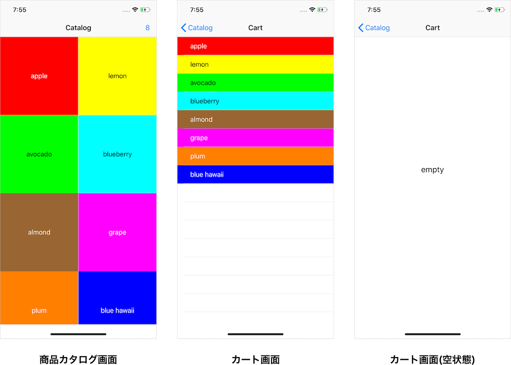

# ShoppingCart
[![Swift 5.0][swift-image]][swift-url]

## Screenshot
<p align="left">
    
</p>

## About
sample code for [AbemaTV iOSチーム 技術書典](https://techbookfest.org/event/tbf06/circle/38450002) "BLoC Pattern Introduction with Swift "

## Getting Started
Install the latest version of Carthage.

```
brew install carthage
```

Run following to build dependency frameworks.

```
carthage bootstrap --platform iOS
```

## SeeAlso
#### BLoC
*Business Logic Component*
- [Flutter / AngularDart – Code sharing, better together (DartConf 2018) - YouTube](https://www.youtube.com/watch?v=PLHln7wHgPE)
- [Build reactive mobile apps with Flutter (Google I/O '18) - YouTube](https://www.youtube.com/watch?v=RS36gBEp8OI)

[swift-url]: https://swift.org/download/
[swift-image]: https://img.shields.io/badge/swift-5.0-brightgreen.svg?style=flat
